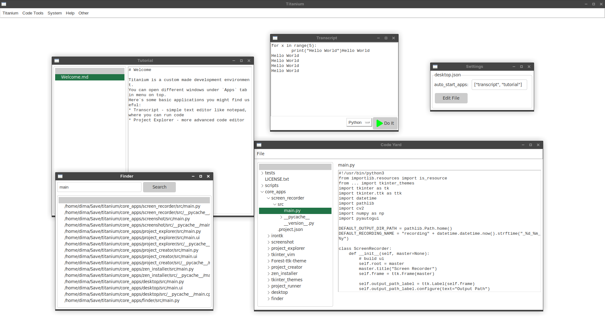

# Titanium

My custom made IDE

.

## Launching

install pygubu before running from pip

run `make run` or `python3 -m core_apps.desktop.src.main` in root directory

## Requirements
* pygubu

## Builtin Apps

* Code Yard - standard text editor
* Project Explorer - different approach to editing projects
* Transcript - minimalist window for running code